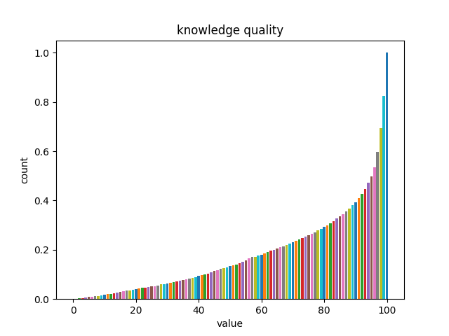

<h1 align="center">PromeTrans: Bootstrap Binary Functionality Classification with Knowledge Transferred from Pre-trained Models</h1>

<h4 align="center">
<p>
<a href=#about>About</a> |
<a href=#data>Data</a> |
<a href=#details>Details</a> |
<a href=#code>Code</a>
<p>
</h4>

## About
PromeTrans is a novel framework to transfer knowledge from LLMs into assembly language model thus enhance binary program comprehension.

## Data

### GPT-dataset

```json
{
   "adt_null.so@add_event": "void __fastcall add_event(void *thd, const char *var, LEX_CSTRING event, const char *data, size_t data_length)\n{\n  size_t v5; // rbx\n  size_t v6; // rax\n  size_t v7; // rbx\n  size_t v8; // r14\n  __int64 v9; // rax\n  char *v10; // r12\n  void (*v11)(__int64, size_t, const char *, ...); // r11\n  __int64 v12; // rax\n  const char *str; // [rsp+0h] [rbp-40h]\n\n  v5 = data_length + event.length + 4;\n  str = event.str;\n  v6 = strlen(var);\n  v7 = v6 + v5;\n  v8 = v6;\n  v9 = ((__int64 (__fastcall *)(_QWORD, size_t, __int64))*mysql_malloc_service)(0LL, v7, 8LL);\n  v10 = (char *)v9;\n  v11 = *(void (**)(__int64, size_t, const char *, ...))my_snprintf_service;\n  if ( v8 )\n  {\n    v11(v9, v7, \"%s%s%s;%s;\", var, \"\\n\", str, data);\n    v12 = 1LL;\n  }\n  else\n  {\n    v11(v9, v7, \"%s%s%s;%s;\", var, \"\", str, data);\n    v12 = 2LL;\n  }\n  v10[v7 - v12] = 0;\n  *mysql_sysvar_event_record.resolve(thd, mysql_sysvar_event_record.offset) = v10;\n}\n"
}
```
```json
{
   "adt_null.so@add_event": "Database module."
}
```

The decompile code is uploaded to gpt-3.5-turbo, and the functionality of "add_event" in "adt_null.so" is "database."


### POJ-dataset
```json
{
   "4489b571cf5d55b86544db8eda7cc79a3931ab06b9e24df6d9ba6b350f42e6e9": 
   {
      "index": "0",
      "code": "#include \"temp.h\"\nvoid factor(int x,int limit);\nint result;\nint main()\n{\n\tint n;\n\tscanf(\"%d\",&n);\n\tint input;\n\tfor(int i=0;i<=n-1;i++)\n\t{\n\t\tscanf(\"%d\",&input);\n\t\tresult=1;//limit?2?????result=1;\n\t\tfactor(input,2);//limit?2?????result=1;\n\t\tprintf(\"%d\\n\",result);\n\t}\n\treturn 0;\n}\nvoid factor(int x,int limit)\n{\n\tint remainder;\n\tif(x<limit)\n\t{\n\t\treturn;\n\t}\n\tfor(int i=limit;i<=x;i++)\n\t{\n\t\tremainder=x%i;\n\t\tif(remainder==0)\n\t\t{\n\t\t\tif(x/i>=i)\n\t\t\t{\n\t\t\t\tresult++;\n\t\t\t\tfactor(x/i,i);\n\t\t\t}\n\t\t}\n\t}\n}",
      "label": "1",
      "name": ["main", "_Z6factorii"]
   }
}
```
The key of json is the hash value of the target binary,  "code" is the source code of the algorithm, "label" is the algorithm class, and "name" contains function names related to this algorithm in binary.

We upload data/POJ-dataset/4489b571cf5d55b86544db8eda7cc79a3931ab06b9e24df6d9ba6b350f42e6e9 as an example; other binaries are not yet available because of Github's storage limitation. We will subsequently make these data public on Google Cloud Storage.

### POJ-test
Files in ./data/POJ-testset are test set of POJ-dataset, present as PromeTrans input format.


### Data Quality



## Details
We use the following prompt for functionality query.
```
You are a professional programmer, analyze the following C function: \textcolor{red}{CODE}. You should comprehend the function and provide functionality, The functionality type can only be chosen from 'audio, interface, image, ui, math, authorization, time, database, sync, protocol, syscall, crypto, compress, resource, hash, network, algorithm, file, string, memory and unknown'. Reply with a JSON dictionary where key is the function name and value is the proposed functionality type. Do not explain anything, only print the JSON dictionary.
```

The files in ./data/POJ-testset present the input format of PromeTrans.
```json
"ec116cad82cf4bce9ae05c6626aed4dc": {
        "token_sequence": [
            "endbr64",
            "push",
            "rbp",
            "mov",
            "rbp",
            "rsp",
            "sub",
            "rsp",
            "CONST",
            "mov",
            "rax",
            "fs:xxx",
            "mov",
            "[rbp+var_xxx]",
            "rax",
            "xor",
            "eax",
            "eax",
            "mov",
            "[rbp+var_xxx]",
            "CONST",
            "jmp",
            "JUMP_ADDR_65",
            "lea",
            "rax",
            "[rbp+var_xxx]",
            "mov",
            "rsi",
            "rax",
            "lea",
            "rax",
            "unk_xxx",
            "mov",
            "rdi",
            "rax",
            "mov",
            "eax",
            "CONST",
            "call",
            "callfunc_xxx",
            "mov",
            "eax",
            "[rbp+var_xxx]",
            "mov",
            "edi",
            "eax",
            "call",
            "callfunc_xxx",
            "mov",
            "esi",
            "eax",
            "lea",
            "rax",
            "CONST",
            "mov",
            "rdi",
            "rax",
            "mov",
            "eax",
            "CONST",
            "call",
            "callfunc_xxx",
            "add",
            "[rbp+var_xxx]",
            "CONST",
            "cmp",
            "[rbp+var_xxx]",
            "CONST",
            "jle",
            "JUMP_ADDR_23",
            "mov",
            "eax",
            "CONST",
            "mov",
            "rdx",
            "[rbp+var_xxx]",
            "sub",
            "rdx",
            "fs:xxx",
            "jz",
            "JUMP_ADDR_83",
            "call",
            "callfunc_xxx",
            "leave",
            "retn"
        ],
        "call_to": {
            "ff8802d3d7994f4f927f7e85a7b7429d": [
                39
            ],
            "fef58954f37c43b29f6fba8797f0f5ea": [
                47
            ],
            "552b8703d5ca4043be7dbd8380484d76": [
                61
            ],
            "938a16e4e5a94a21a7193f34c788419f": [
                82
            ]
        },
        "call_external": {},
        "function_name": "main",
        "function_addr": 4553
    }
```
This json item is the disassembly code of main function, the key is function id and the value is disassembly data. Token sequence is disassembly code, call_to contains call graph information, call_external record external callee function.

## Code

This document describes the source code of PromeTrans.


### Requirements
- Python 3.6 or higher
- [PyTorch](https://pytorch.org/get-started/locally/)
- [Transformers library](https://huggingface.co/docs/transformers/installation)
- A CUDA-enabled GPU is highly recommended for faster processing.

Ensure you have Python and PyTorch installed on your system. Then, install the Transformers library using pip:
```bash
pip install transformers
```

### Dataset

Code for data process in model/analyze


### Training and Inference

Code for training and inference in model/